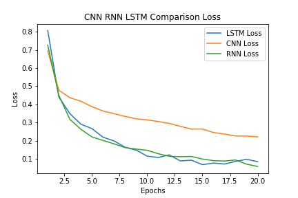
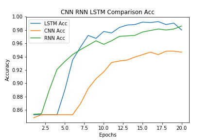

# GSM Tweet Sentiment Analysis Classification

         

SENTIMENT ANALYSIS WITH DEEP LEARNING METHODS OF PUBLISHED TURKİSH TWEETS FOR GSM OPERATORS

Comparison of different deep learning methods in sentiment classification

## LSTM has achieved a more successful result

 
